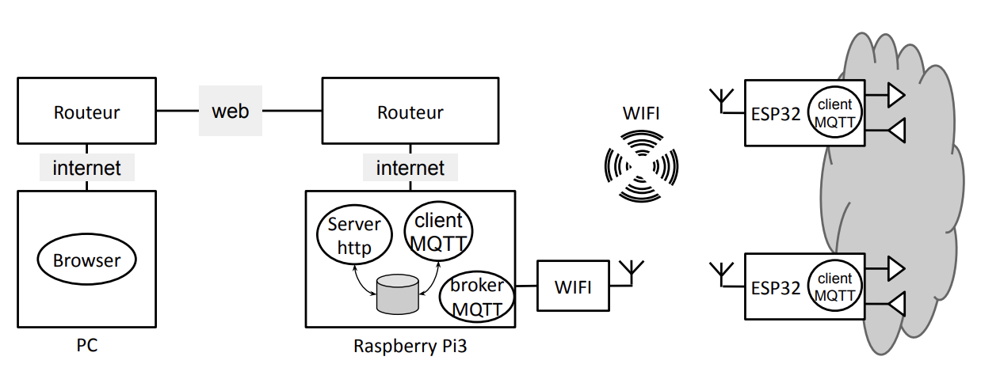
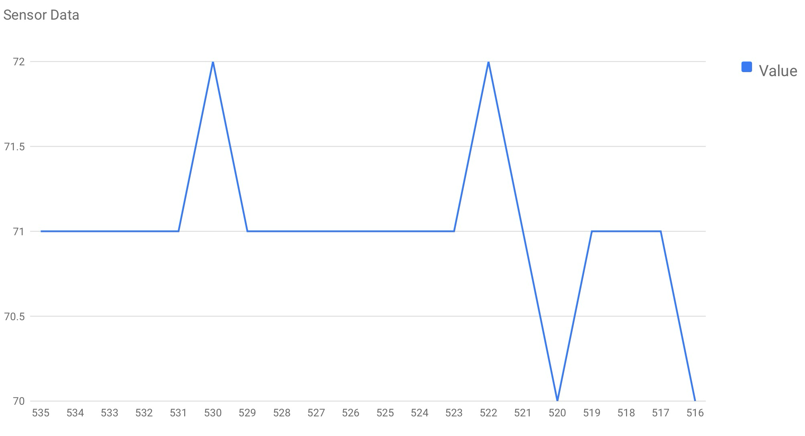

# Projet IOC

Intégrants de l'équipe :

- **Lou THIRION** : 28614980
- **Jorge MENDIETA** : 21304469

## Présentation



## Plateforme matérielle

La plateforme matérielle se compose de :

- 1 à 2 modules **ESP32** (TTGO-Lora-OLED V1) sur lesquels il y a des capteurs, une photorésistance et 2 boutons-poussoirs (1 sur le module, 1 sur la carte), et des "actionneurs" un écran, une led et, pour certains, un buzzer.
- Une carte **Raspberry Pi 3** sur laquelle est installé un système Linux.

### La Raspberry Pi 3

Les logiciels utilisés sur la Raspberry pour notre projet sont les suivants :

- Un **Serveur HTTP** pour répondre au client navigateur WEB et récupérer les valeurs des capteurs ou envoyer des commandes pour les actionneurs.
- Une **Application Gateway** qui fait le lien entre le serveur HTTP et les capteurs. Cette application est composée de:
  - Un **client MQTT** qui récupère des data (par subscribe) ou émet des commandes (par publish) aux clients MQTT présents sur les ESP32.
  - Un **broker MQTT** qui assure le "routage" des messages entre les clients
  - Une "**base de données**" qui enregistre les valeurs envoyées par les ESP32.

### Les ESP32

Pour l'ESP32, le logiciel comporte 2 parties principales :

- Un **client MQTT** qui "*publish*" ou "*subscribe*" des messages destinés ou provenant du client MQTT s'exécutant sur la Raspberry Pi 3.
- Une partie qui comporte plusieurs tâches permettant d'intéragir avec les capteurs et actionneurs.

## Étapes du projet

La première partie du projet consiste à créer une **preuve de concept** afin de vérifier un système minimal qui s'exécute correctement. Puis, dans un deuxième temps, l'objectif sera d'implémenter la preuve de concept sur le matériel (RPI3, ESP32).

Pour la **version définitive**, voici les différentes étapes du projet :

- Implémentation MQTT sur l'ESP32 et un broker MQTT publique
- Flash de Raspberry Pi OS (64-bit)
- Mise en place du broker MQTT *Mosquitto* sur la Raspberry
- Implémentation de la base de données SQLite3
- Implémentation du serveur web avec le framework Flask (Python)
- Intégration de tous les composants

---

# Preuve de concept

Sur une même machine, nous allons tester les composants suivants :

- Serveur HTTP
- Gateway (Broker MQTT + 1 Client MQTT)
- Base de données (avec un simple fichier texte)
- Clients MQTT qui devront être présents sur les ESP32

## Installation de la Raspberry

### Démarrage et login

En ce qui nous concerne, l'OS raspbian était déjà installé sur notre carte. Il n'y avait qu'à brancher la carte pour qu'elle boot.

Une fois la carte démarré, nous avons choisi un nom d'utilisateur et un mot de passe :

- login : mendietathirion
- password : azerty

### Connexion au réseau

Ensuite l'objectif est de connecter la carte à un réseau (local ou internet) pour pouvoir y accéder en ssh depuis une autre machine.

Pour cela il a fallu trouver les commandes bash permmettant d'utiliser les périphériques WiFi et Ethernet. Dans un premier temps nous allons nous utiliser le WiFi de la carte.

Nous disposons donc des outils suivants:

- `ifconfig` : Pour activez votre périphérique ou carte sans fil.
- `iwlist` : Pour lister les points d’accès sans fil disponibles.
- `iwconfig` : Pour configurer votre connexion sans fil.
- `dhclient` : Pour obtenir votre adresse IP via DHCP.

#### Activation du périphérique avec ipconfig

On commence avec la commande suivante qui permet d'activer le périphérique WiFi :

```shell
ifconfig wlan0 up
```

**Problème**, on obtient l'affichage suivant, qui nous dit que l'interface WiFi est vérrouillée :

```
SIOCSIFFLAGS: Opération impossible du fait de RF-kill
```

#### Devérrouillage d'un périphérique avec rfkill

Pour la débloquer, on utilise la commande rfkill :

- Nous commençons par lister les composants vérrouillés

```shell
$ rfkill list
0: phy0: Wireless LAN
     Soft blocked: yes
     Hard blocked: no
```

- Puis on débloque le composant qui nous intéresse

```shell
rfkill unblock 0
```

On peut ensuite réexécuter notre commande ipconfig pour activer le périphérique et cette fois aucun message d'erreur et on peut vérifier en exécutant simplement ipconfig que notre périphérique est bien actif.

#### Scan du réseau

Pour scanner le réseau :

```shell
iwlist wlan0 scan
```

**Problème**, on obtient l'affichage suivant:

```shell
wlan 0    No scan results
```

Il fallait exécuter la commande en tant que superuser afin de réussir le scan des réseaux:

```shell
sudo iwlist wlan0 scan
```

Nous avons activé un hotspot sur notre portable, ensuite à l'aide de grep nous avons bien confirmé que la raspberry pi réussit à scanner ce nouvel SSID.

```shell
$ sudo iwlist wlan0 scan | grep Giorgio
ESSID:"Giorgio Mendieta"
```

**Ça marche pas !!!**
Malheureusement nous n'avons pas réussi à connecter la Raspberry à internet avec les commandes bash.

Pour le débloquage des périphériques avec rfkill :
<https://debian-facile.org/doc:reseau:rfkill>

Pour les différentes étapes avec les commandes bash pour se connecter en réseau :
<https://www.tech-connect.info/tutoriels/connexion-a-un-reseau-sans-fil-en-ligne-de-commande-sur-linux/956/>

#### Connexion par USB

Une solution qui fonctionne c'est de faire un partage de connexion avec le téléphone directement par USB. Ça se connecte automatiquement.

#### Utilisation de l'interface graphique pour se connecter au WiFi

Finalement la solution la plus simple est d'accéder à l'interface graphique (GUI) et de se connecter au WiFi.

## Connexion MQTT et débogage dans la Raspberry Pi

**Remarque** : Pour que ça fonctionne il faut que tout soit sur le même réseau WiFi.

### Broker MQTT avec Mosquitto

Pour héberger un broker MQTT, il faut installer `mosquitto`.

Pour lancer le service du broker :

```shell
systemctl start mosquitto
```

Pour l'arrêter :

```bash
systemctl stop mosquitto
```

Nous pouvons activer le mode verbose avec le flag `-v` :

```bash
sudo mosquitto –v
```

Vérifier si le broker est bien lancé :

```bash
sudo netstat -tanlp | grep 1883
```

**Remarque :** Il faut ajouter les lignes suivantes au fichier `/etc/mosquitto/mosquitto.conf` :

```c
listener 1883 0.0.0.0
allow_anonymous true
```

L'adresse `0.0.0.0` correpond à un masque qui va autorisé toutes les adresses IP à se connecter au broker, on pourrait mettre seulement l'adresse IP de la machine qui héberge le broker.

### Subscriber Mosquitto

Pour le subscriber et le publisher il faut installer `mosquitto-clients`.

Pour lancer un subscriber qui va attendre une donnée:

```shell
mosquitto_sub -h 192.168.1.3 -p 1883 -t "TopicSub"
```

Il faut récupérer l'adresse IP de la machine où le broker s'exécute avec la commande `hostname -I`. Il n'est pas obligatoire de spécifier le port car il sera égale à `1883` par défault.

### Publisher Mosquitto

Pour envoyer un message avec un publisher :

```shell
mosquitto_pub -h 192.168.1.3 -p 1883 -t "TopicSub" -m "Message à Publier"
```

## MQTT avec Paho MQTT en Python

Pour utiliser le protocole MQTT avec Python il faut d'abord installer la librairie [Paho MQTT](https://pypi.org/project/paho-mqtt/) avec la commande `pip install paho-mqtt`, de préference sur un environement virtuel (venv).

### Publisher et Subscriber Paho

Voici un code python permettant de se connecter à un broker et de publier un message

```python=
import paho.mqtt.client as mqtt

# Callback connexion broker
def on_connect(client, userdata, flags, rc):
    printf("Connecté " + str(rc))
    client.subscribe("inTopic")

# Callback subscriber
def on_message(client, userdata, msg): 
    printf("Message reçu : {msg.topic} {str(msg.payload)}")

# Création d'une instance client
client = mqtt.Client(mqtt.CallbackAPIVersion.VERSION2)
client.on_connect = on_connect # Assignation des callbacks
client.on_message = on_message
client.connect("192.168.43.173", 1883, 60) # Connexion au broker

client.publish("inTopic", "Hello World") # Publication d'un message
```

## MQTT sur l'ESP32

Pour connecter l'ESP32 au server MQTT nous utilisons la librairie **PubSubClient.h** que l'on peut trouver facilement parmi les librairies téléchargeables dans l'éditeur Arduino.

```c=
#include <WiFi.h>
#include <PubSubClient.h>

const char* ssid     = "connexionLT";
const char* password = "thirionlou";

WiFiClient espClient; 
PubSubClient client(espClient);

void setup()
{
  Serial.begin(9600);
  delay(10);

    // We start by connecting to a WiFi network
    Serial.print("Connecting to ");
    Serial.println(ssid);

    WiFi.begin(ssid, password);

    while (WiFi.status() != WL_CONNECTED) {
        delay(500);
        Serial.print(".");
    }

    Serial.println("");
    Serial.println("WiFi connected");
    Serial.println("IP address: ");
    Serial.println(WiFi.localIP());

  // connecting to the server MQTT
  Serial.println("Server connecting");
  
  client.setServer("192.168.43.246", 1883);

  while(!client.connected()) {
  if (client.connect("arduinoClient")) {
    Serial.println("publish");
    client.publish("hello","connection");
  } else {
    Serial.println("connection failed");
  }
  delay(500);
  }
}

void loop()
{
  client.loop();
  client.publish("hello","hello world");
  delay(1000);
}
```

### Connexion WiFi

On commence par connecter l'ESP32 au WiFi en utilisant la librairie **WiFi.h**. L'API WiFi pour Arduino est très simple à utiliser. Il suffit d'appeler la fonction `wifi.begin` avec deux arguments, l'identifiant **SSID** et le **mot de passe**. Puis on attend que la fonction `WiFi.status()` retourne `WL_CONNECTED` pour vérifier que la connexion a réussi.

Encore une fois, ici, pour que tout fonctionne il faut que tous les appareils soient sur le même SSID.

### Connexion au broker MQTT

On commence par créer un client auquel on spécifie le type de réseau que l'on utilise (WiFi, Ethernet, ...) puis l'adresse IP du server et enfin le numéro de port. Dans notre code on a commencé par créer le client en ne spécifiant uniquement le type de réseau que l'on utilise puis seulement une fois que l'ESP32 est connécté au WiFi, on spécifie au client l'adresse IP et le port avec la fonction setServeur(adresseIP, port).

Pour se connecter au broker il nous reste à appeler la fonction connect avec notre client préalablement créé et l'identifiant de notre client. Dans notre code on peut voir que l'on boucle sur la fonction connect jusqu'à ce que la fonction connected() appeler avec le client renvoie true, c'est à dire que notre client est bien connécté au broker.

Enfin il n'y a plus qu'à envoyer notre message au server avec la fonction publish.

### Le subscriber

Pour souscrire à un topic avec l'ESP32 on reprend notre code qui a servit pour envoyer un message et nous avons besoin d'y ajouter une fonction callback qui sera appelée à chaque fois qu'un message est reçu et ce message sera passé en paramètre de la fonction.

```c=
void callback(char* topic, byte* payload, unsigned int length) {
  Serial.println("Message arrived");
  Serial.println(topic); 
  for (int i = 0; i < length; i++) { 
    Serial.print((char) payload[i]); 
  }
}
```

Puis on associe cette fonction callback à notre client.

```c=
client.setCallback(callback);
```

Enfin, une fois que la connexion avec le broker établi, il reste à appeler la fonction subsribe avec un certain topic.

```c=
client.subsribe(topic);
```

Exemple de connexion WiFi MQTT sur l'ESP32 :
<https://letmeknow.fr/fr/blog/180-tuto-mqtt-sur-esp32-mosquitto>

Documentation pour l'API PubSubClient pour MQTT sur Arduino :
<https://pubsubclient.knolleary.net/api#loop>

**Remarques sur la preuve de concept** :

Les premières connexions MQTT on été réalisé avec l'OS de Émile car il avait l'interface graphique déjà installé avec son OS et pas nous. Donc soit on arrive à installer un gestionnaire de fenêtre soit on reflash notre carte SD pour recommencer sur de meilleurs bases avec une interface graphique

---

# Mise en place définitive

Pour la mise en place définitive, on a presque refait tout afin de commencer avec une structure plus "propre".

## Mise en place du protocole MQTT sur l'ESP32

D'abord, on a arreté d'utiliser l'IDE de Arduino et on a commencé à utiliser [PlatformIO](https://platformio.org) avec l'editeur Visual Studio Code. Cela est préferable car VS Code offre plusieurs avantages par rapport à l'IDE (très basique) d'Arduino.
On a décidé de séparer les différentes parties en fichiers `.h` afin de simplifier le développement, et créer un projet plus modulaire. La structure est désormais la suivante :

```shell
ESP32_MQTT on  main ⇡1 ?1
➜ tree
.
|-- include
|   |-- README
|   |-- credentials.h
|   |-- intercommunication.h
|   |-- internet.h
|   |-- mqtt.h
|   |-- photoresistance.h
|   |-- pushbutton.h
|   |-- screen.h
|   `-- utils.h
`-- src
    |-- mqtt_esp32.cpp
    `-- output
```

J'ai d'abord utilisé une approche naïve pour publier un message toutes les 2 secondes avec la fonction bloquante `delay()`.
Finalement, j'ai opté pour l'approche multi-tâches telle que vue lors des TP et j'ai publié un message en utilisant la tâche.

```c
void loop_photo(struct t_photoresistance *ctx, t_mailbox *mb)
{
    ctx->val = map(analogRead(ctx->pin), 4095, 0, 0, 100); // Map the value to a 0-100 range
    mb->val = ctx->val;

    // Wait for the period to elapse
    if (!waitFor(ctx->timer, ctx->period))
        return;

    snprintf(msg, MSG_BUFFER_SIZE, "%ld", ctx->val);
    Serial.print("Published to [esp32/photoVal]: ");
    Serial.println(msg);
    client.publish("esp32/photoVal", msg);
}
```

J'ai finalement implémenté l'écran OLED pour afficher le SSID, l'adresse IP et la valeur de la photorésistance.

## Configuration de la Raspberry Pi 3

D'abord, nous avons utilisé une carte SD afin de flasher le Raspberry Pi OS (64-bit) avec l'outil [Raspberry Pi Imager](https://www.raspberrypi.com/software/). Une fois l'image flashée et le WiFi réglé, nous avons configuré la connexion par SSH.

J'ai créé une clé SSH avec `ssh-keygen -b 2048 -t rsa` pour pouvoir cloner le repo depuis mon compte GitHub afin de travailler plus facilement.
J'ai eu quelques difficultés à me connecter via la configuration ssh, puis j'ai remarqué que je partageais la clé publique (.pub) alors que j'avais besoin de partager la clé privée.

La configuration pour simplifier la connexion par ssh était décrite dans le fichier `/Users/giorgio/.ssh/config`

```sh
Host rpi
  User giorgio
  Hostname raspberrypi.local
  AddKeysToAgent yes
  UseKeychain yes
  IdentityFile ~/.ssh/id_ed25519
```

## MQTT sur la Raspberry Pi 3

On a installé `mosquitto` et `mosquitto-clients` avec `apt get`. Puis j'ai démarré le service avec `systemctl start mosquitto.service` et j'ai vérifié l'adresse IP de la RPI avec `hostname -I`.

J'ai ensuite réinitialisé le RPI, et le broker MQTT a fonctionné correctement !!!
J'ai vérifié avec `sudo netstat -tlnp | grep 1883`. Le résultat était le suivant :

```shell
tcp 0 0 0.0.0.0:1883 0.0.0.0:*LISTEN 684/mosquitto
tcp6 0 0 :::1883 :::* LISTEN 684/mosquitto

```

J'ai testé ceci en utilisant une application sur mon téléphone appelée MyMQTT

**Problèmes rencontrés**

Sur le raspberry, j'ai rencontré un problème en utilisant MQTTv5 avec le client paho-mqtt.
En faisant des recherches, je suis tombé sur une [discussion en GitHub](https://github.com/eclipse/paho.mqtt.python/issues/575). Apparemment la fonction `on_connect()` avait besoin de 5 arguments mais il n'y en avait que 4.
Le problème a été résolu en passant un paramètre vide *props*.

```python
def on_connect(client, userdata, flags, rc, props=None):
```

## Base de données SQLite3

Il fallait installé la librairie sqlite3 avec `sudo apt install sqlite3`.
J'ai décidé d'utiliser **phpliteadmin** pour faciliter la gestion de la base de données avec une interface web, d'après [cette vidéo](https://www.youtube.com/watch?v=3Ic7CZZ0a_U) de YouTube.

Dépendances `php-mbstring`, `apache2`, `php`, `libapache2-mod-php`
Activation et démarrage du service apache2 `sudo systemctl enable apache2` et `sudo systemctl start apache2`
Entrer dans le répertoire par défaut du serveur `cd /var/www/html/` et création d'un répertoire `database`.
J'ai ensuite téléchargé phpLiteAdmin depuis bitbucket en utilisant `sudo wget https://bitbucket.org/phpliteadmin/public/downloads/phpLiteAdmin_v1-9-8-2.zip`, décompressé le fichier et copié le fichier de configuration par défaut.

Le mot de passe par défaut pour la base de données est "admin" sans guillemets, et j'ai spécifié le chemin de la base de données `/home/giorgio/Developer/IOC-TME/Projet/Database` dans le fichier de configuration de phpLiteAdmin situé à `/var/www/html/database/phpliteadmin.config.php`

J'ai ensuite accédé à la page en utilisant l'IP locale de la RPI, dans ce cas c'était **192.168.1.3**.

<http://192.168.1.3/database/phpliteadmin.php>

Cependant, il y a eu une erreur, j'ai obtenu une page blanche.
J'ai vérifié les logs dans `/var/log/apache2/error.log` et après avoir cherché en Google l'erreur, apparemment j'utilisais la mauvaise version de phpLiteAdmin qui n'est pas compatible avec **PHP8.2**. J'ai donc téléchargé la bonne version en utilisant un nouvel lien avec `sudo winget http://www.phpliteadmin.org/phpliteadmin-dev.zip`. Puis j'ai refait les étapes d'installation et la page fonctionnait correctement.

Je me suis connecté en utilisant le mot de passe par défaut et j'ai commencé à créer la structure de la table DB en exécutant la requête SQL suivante.

```sql
CREATE TABLE "IOTSensors" ( ID INTEGER PRIMARY KEY, deviceName TEXT, 'sensor' TEXT, 'reading' INT ,'timestamp' DATETIME)
```

J'ai ensuite vérifié le schéma de la table avec la commande `.fullschema` dans le client sqlite3

```shell
giorgio@raspberrypi:/databases $ sqlite3 ioc_project.db
SQLite version 3.40.1 2022-12-28 14:03:47
Entrez ".help" pour des conseils d'utilisation.
sqlite> .fullschema
CREATE TABLE IF NOT EXISTS "IOTSensors" ( ID INTEGER PRIMARY KEY, deviceName TEXT, 'sensor' TEXT, 'reading' INT ,'timestamp' DATETIME) ;
/*Aucune table STAT disponible*/
```


## Serveur HTTP avec Flask en Python

Pour utiliser des librairies externes en python, c'est généralement préférable de créer un environnement virtuel, nommé venv avec la commande `python3 -m venv ./venv`.
J'ai ensuite activé l'environnement virtuel pour pouvoir installer des paquets sans casser l'installation principale de python avec `source ./venv/bin/activate`

Puis j'ai installé le framework **Flask** afin de créer une application web avec Python en utilisant la commande `sudo pip3 install flask`. J'ai également installé le client MQTT **paho-mqtt** avec `sudo pip3 install paho-mqtt`.

Un grand avantage de Flask est que l'on peut utiliser des templates pour les pages HTML, en créant un "look" plus uniforme. Une autre avantage est qu'on peut passer des variables depuis le serveur afin de créer une page web dynamique. Cela est très utile pour obtenir des données depuis la BD SQLite3.

La structure du serveur est la suivante :

```shell
ServerFlask on  main ?1
➜ tree
.
|-- __pycache__
|   |-- app.cpython-311.pyc
|   `-- database.cpython-311.pyc
|-- app.py
|-- flask_session
|-- ioc_project.db
|-- readme.md
|-- requirements.txt
|-- rpi_mqtt_client.py
|-- static
|   |-- favicon.ico
|   `-- style.css
`-- templates
    |-- apology.html
    |-- index.html
    `-- layout.html

5 directories, 12 files
```

Example d'une table remplie dynamiquement avec la BD :

```html
<tbody>
    
    <tr>
        <td class="text-end">{{ entry.ID }}</td>
        <td class="text-start">{{ entry.deviceName }}</td>
        <td class="text-start">{{ entry.sensor }}</td>
        <td class="text-end">{{ entry.reading }}</td>
        <td class="text-end">{{ entry.timestamp }}</td>
    </tr>
    
</tbody>
```

En testant le serveur sur ma machine locale, j'ai eu quelques problèmes avec des timeouts de socket. J'ai débogué et le problème venait de la connexion MQTT puisque je n'avais pas démarré le service mosquitto sur mon Macbook.

### Format HTML et CSS

J'ai ensuite utilisé [**Bootstrap 5.3**](https://getbootstrap.com) pour utiliser des styles CSS intégrés afin de simplifier la conception de la page web.

```html
<!-- http://getbootstrap.com/docs/5.1/ -->
<link crossorigin="anonymous" href="https://cdn.jsdelivr.net/npm/bootstrap@5.1.3/dist/css/bootstrap.min.css"
    integrity="sha384-1BmE4kWBq78iYhFldvKuhfTAU6auU8tT94WrHftjDbrCEXSU1oBoqyl2QvZ6jIW3" rel="stylesheet">
<script crossorigin="anonymous" src="https://cdn.jsdelivr.net/npm/bootstrap@5.1.3/dist/js/bootstrap.bundle.min.js"
    integrity="sha384-ka7Sk0Gln4gmtz2MlQnikT1wXgYsOg+OMhuP+IlRH9sENBO0LRn5q+8nbTov4+1p"></script>() 
```

J'ai également implémenté Google charts (<https://developers.google.com/chart/interactive/docs/gallery/linechart>) pour mieux visualiser les données d'après les suggestions du professeur sur le cours d'IOC.

En lisant la documentation en ligne, nous avons remarqué qu'il existait une version nouvelle, donc on a changé quelques lignes pour utiliser cette nouvelle version.

```html
<!-- Google chart -->
<script type="text/javascript">

    // Load the Visualization API and the Material Line Chart package.
    google.charts.load('current', { 'packages': ['line'] });

    // Set a callback to run when the Google Visualization API is loaded.
    google.charts.setOnLoadCallback(drawChart);

    // Callback that creates and populates a data table, instantiates the pie chart, passes in the data and draws it.
    function drawChart() {

        // Create the data table and populate it with the readings from the database
        var data = new google.visualization.arrayToDataTable([
            ['ID', 'Value'],
            
            ['{{ entry.ID }}', {{ entry.reading }}],
            
        ]);

        // Set chart options
        var options = {
            'title': 'Sensor Data',
            'curveType': 'function',
            'legend': { position: 'bottom' }
        };

        // Instantiate and draw the chart, passing in some options.
        var chart = new google.charts.Line(document.getElementById('linechart_material'));
        chart.draw(data, google.charts.Line.convertOptions(options));
    }
</script>

<!-- Container for the line chart -->
<div id="linechart_material" style="width: 900px; height: 500px"></div>
```



### Requêtes HTTP

La page principale comporte un graphique montrant les données stockées dans la BD, ainsi qu'une table avec ces données.

```python
@app.route("/", methods=["GET", " POST"])
def main():
    conn = sqlite3.connect(DATABASE_PATH)
    conn.row_factory = dict_factory
    c = conn.cursor()
    c.execute("SELECT * FROM IOTSensors ORDER BY id DESC LIMIT 20")
    readings = c.fetchall()

    if request.method == "POST":
        payload = request.form.get("payload")
        mqttc.publish("rpi/broadcast", payload)
        flash("Payload sent!")

    return render_template("index.html", readings=readings)
```

Finalement, j'ai ajouté quelques boutons et utilisé des requêtes POST HTTP pour allumer/éteindre la LED de l'ESP32.

```python
@app.route("/ledOn", methods=["GET", "POST"])
def ledOn():
    if request.method == "POST":
        payload = request.form.get("ledOn")
        # print("Payload: " + payload)
        mqttc.publish("rpi/broadcast", "ledOn")
        flash("Led On!")
        # return redirect("/")
        return redirect("/")

    return render_template("/")


@app.route("/ledOff", methods=["GET", "POST"])
def ledOff():
    if request.method == "POST":
        payload = request.form.get("ledOff")
        # print("Payload: " + payload)
        mqttc.publish("rpi/broadcast", "ledOff")
        flash("Led Off!")
        # return redirect("/")
        return redirect("/")

    return render_template("/")
```

**Démarrage du serveur**
Comme décrit auparavant, il faut activer l'environnement virtuel. Puis on exécute la commande `python app.py` dans la racine du projet.

L'adresse du site web est <http://192.168.1.3:8181>

**Problèmes rencontrés**

Après avoir lancé le serveur en utilisant `python app.py`, j'ai rencontré quelques problèmes avec la base de données. J'ai eu un problème concernant "attempt to write to a readonly database" (tentative d'écriture dans une base de données en lecture seule). Après avoir cherché sur internet, il s'agissait apparemment d'un problème concernant les permissions du fichier de la base de données ET du répertoire dans lequel il se trouvait. La raison était que SQLite3 crée des fichiers temporaires lors de la manipulation de la base de données, et si le répertoire qui contient la BD n'a pas les permissions correctes, cela ne marche pas. J'ai donc changé les permissions et cela a fonctionné correctement.


## Points à améliorer

- Implémenter WSGI afin de deployer le serveur Flask dans un serveur, soit Apache, soit Gunicorn par exemple. [Link 1](<https://flask.palletsprojects.com/en/3.0.x/tutorial/deploy/>) [Link 2](<https://flask.palletsprojects.com/en/3.0.x/deploying/>)
- Passer à [Node-RED](https://nodered.org/docs/getting-started/raspberrypi) dans la RPI pour simplifier le dévelopemment du dashboard avec [MQTT](https://cookbook.nodered.org/mqtt/connect-to-broker)
- Pour l'ESP32, utiliser la librairie **MultiWiFi.h** afin de pouvoir se connecter à plusieurs SSIDs parmi une liste quand un SSID n'est pas disponible
- Passer à une implémentation avec authentification pour MQTT afin d'être plus sécurisé
